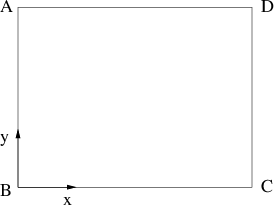
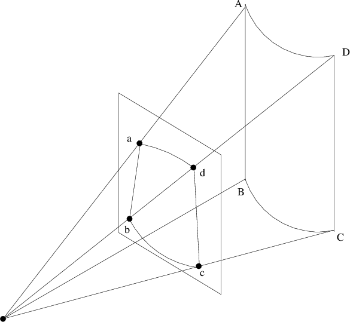
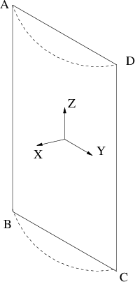
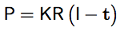

Reconstruction d'étiquettes de bouteilles de vin
==================================================

# Présentation generale du projet

* Définition du problème 
  ** Récuperer la forme rectangulaire d'une étiquette de bouteille de vin à
     partir d'une image.
  ** But : reconstruir la forme de l'étiquette et la position relative de la
     camera, à partir d'une seule image.

* Language de programation

 + Matlab

* Vision par ordinateur, geométrie projective, traitement d'images

# Une première approache

Dans le monde 2D l'étiquette est un rectangle :

La répresentation de la scène dans le monde 3D est montrée à continuation :

On peut definir une système de coordonées en 3D pour formuler un modele de 
distorsion qui soit accorde a notre problème :

La relation entre les pixeles de la camera et l'espace 3D est modelisée par la 
matrice de projection (pour le cas d'un modèle sténotopé ou "pinhole" )

# Liens importants :
[La matrice de projection] (http://ksimek.github.io/2012/08/13/introduction/)

